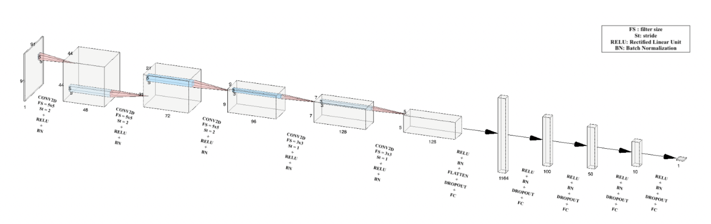

# Age Estimation by CNN Based Regression Model

- _Completed by: Hamdi Alperen Çetin & Emre Doğan_
  
- We propose a Convolutional Neural Network Model to succesfully estimate the age of a person given her/his cropped face image. Different from the classical CNN models, our model ends up with a regression layer, not a classifier one. So, backpropagation process is done based on the regression output.  

- For a more detailed technical report, check [here.](./doc/report.pdf)

## Dataset:
- We trained our model with a downsampled version of [UTKFace Dataset](http://aicip.eecs.utk.edu/wiki/UTKFace). 
- Due to its large size, we cannot share original dataset(all training + validation + test data). But you can find some samples of our dataset from [here](./data-samples/). Notice that the first 3 letters of any image corresponds to its output layer (age of the person in the image).
- Not to spend time on reading data on each execution, we converted our training, validation and test data into .npy format by [read_data.py](./read_data.py).

## Model:

-  Our architecture can be seen in the figure above. It consists of several consecutive convolution layers. Another important point regarding the model is that instead of a classifier approach, we used a regression based model so that backpropagation flow starts from some continuous age value.

To see a more detailed tensorboard graph regarding our model, click [here.](./figures/tensorboard-graph.png)

## Results
- To decide on hyperparameters, we tried many different scenarios. Training and validation losses (Mean Average Error) for each scenario can be found [here.](./results/)

- The best results are taken when the hyperparameters are,  

| Hyperparameter| Choosen Value |
| -------------   | -------------      |
| Loss Function | Mean Sqaure Error	|
| Learning Rate | 0.0001   |
| Dropout Keep Probability | 0.6	|
| L2 Reg. Constant | 0.0001   |
| Batch Size | 200	|

- The corresponding results in our best model is given below, 

| Loss Type       | Mean Average Error |
| -------------   | -------------      |
| Validation Loss | 6.486	       |
| Test Loss 	  | 6.419	       |

